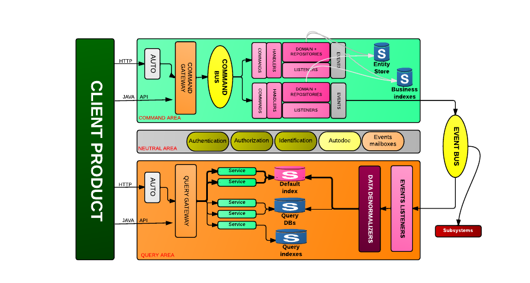

Architecture & principles
=========================

Kasper defines the way the different architecture components must be written and interacts and provides abstract classes for them and some full implementations for infrastructure components.

Kasper defines five responsibility areas :

* The **COMMAND** area is responsible for :
    * defining and handling action commands
    * combining concepts and relations (entities) together with business rules in order to model the business domain
    * generating domain events
    * persisting the entities
    * interact with business indexes for validation purposes

* The **QUERY** area is responsible for :
    * listening for domain events, denormalizing them to a dedicated storage or sending them to another subsystem (mail delivery for instance)
    * defining and handling data queries

* The **NEUTRAL** area provides some platform services to the two other layers, such as :
    * security mechanisms (Authentication/Identifcation) and ACLs (Authorizations)
    * asynchronous errors events and other events storage for the users of the system (either final ones or system users)

* The **PRODUCT**, or platform client :
    * responsible to send commands to the platform, mainly asynchronously, and to manage user flow and interactions (task oriented)
    * responsible for sending data requests to the platform

* The **EVENT PLATFORM** is responsible for dealing for the event communication, persistence and storage, it deals with three kind of events :
    * APPLICATION events are events from the product
    * DOMAIN events are events sent by the domain implementation of the COMMAND area
    * SYSTEM events are events sent by the infrastructure

The implementation of the event platform is not fully part of the Kasper framework, which only manages with APPLICATION and DOMAIN events.

Contents
========

.. toctree::
    :maxdepth: 2

    modules_split

