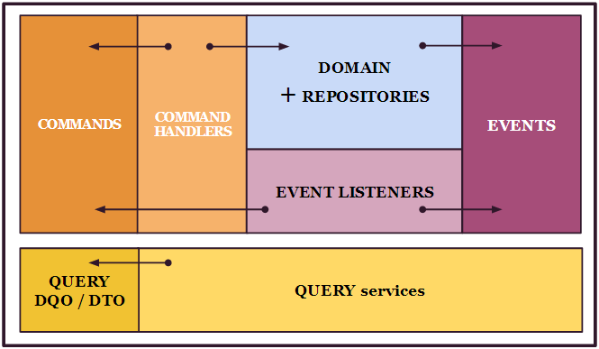
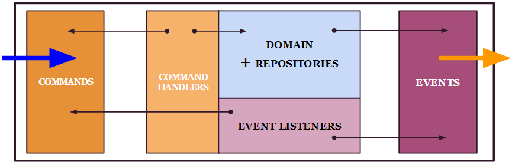

..  _modules_split:

Recommended modules split
=========================

A Kasper domain definition can be encapsulated in only one module, however Kasper framework encourage developers to split their domains in several modules, ensuring strict respect of the domain entities usage, anemic commands and events and atomic dependencies between domains.

The following diagram illustrates the five logical Kasper modules by domain with their dependency relations :

The domain exposition handlers are then clearly identified as being the 'commands', 'events' and 'query' modules :

An alternative, for those who dislike too many modules can be the following split :

.. image:: ../img/modules_split_3.png
    :align: center
    :scale: 80%

BUT, you'll have to be perhaps a bit more strict on the usages of classes depedencies in order to not allow unwanted dependencies :

    * Event listeners should only know commands, it is allowed to make a dependency to domain if domain services are used directly, but be careful..
    * Command handlers should only know domain classes.. and commands
    * Commands, and events must not have any dependency to other domain classes
    * Commands must be known only by command handlers
    * DQOs and DTOs should only be used by query services
    * **NEVER, NEVER, NEVER, NEVER** allow usage of DOMAIN (COMMAND) module by QUERY module
    * **NEVER, NEVER, NEVER, NEVER** allow usage of QUERY module by DOMAIN module
    * **NEVER, NEVER, NEVER, NEVER** allow usage of QUERY or DOMAIN modules by the API module

