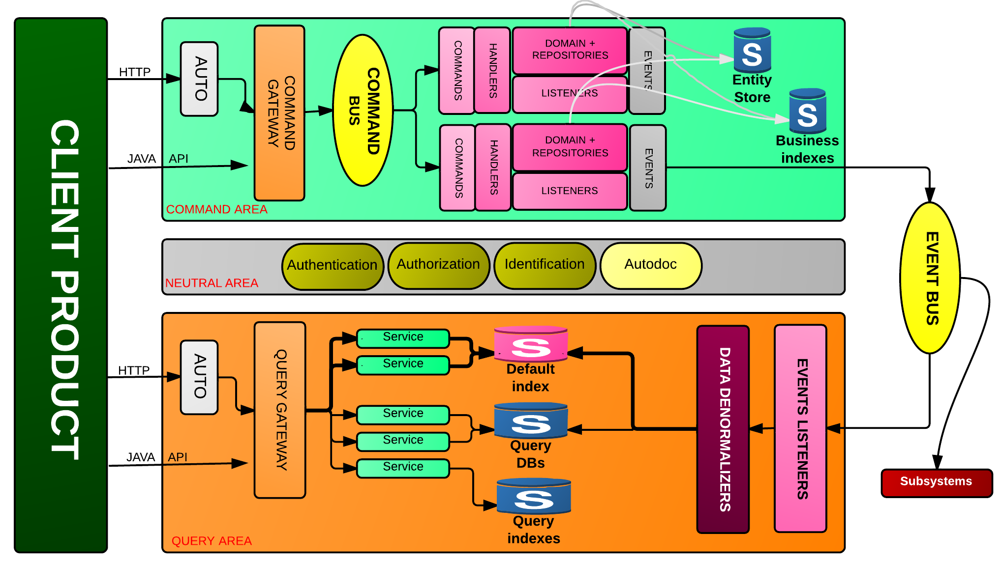
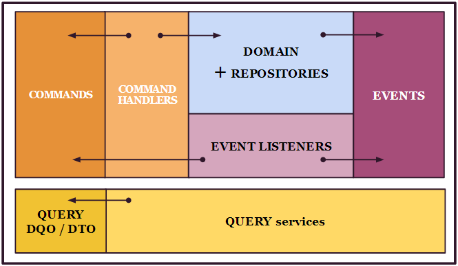
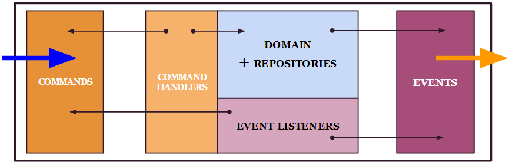
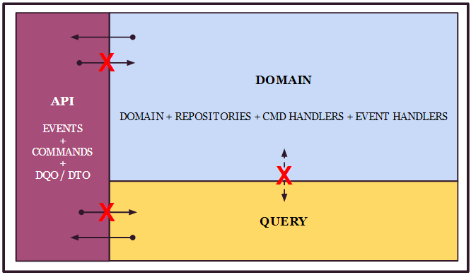
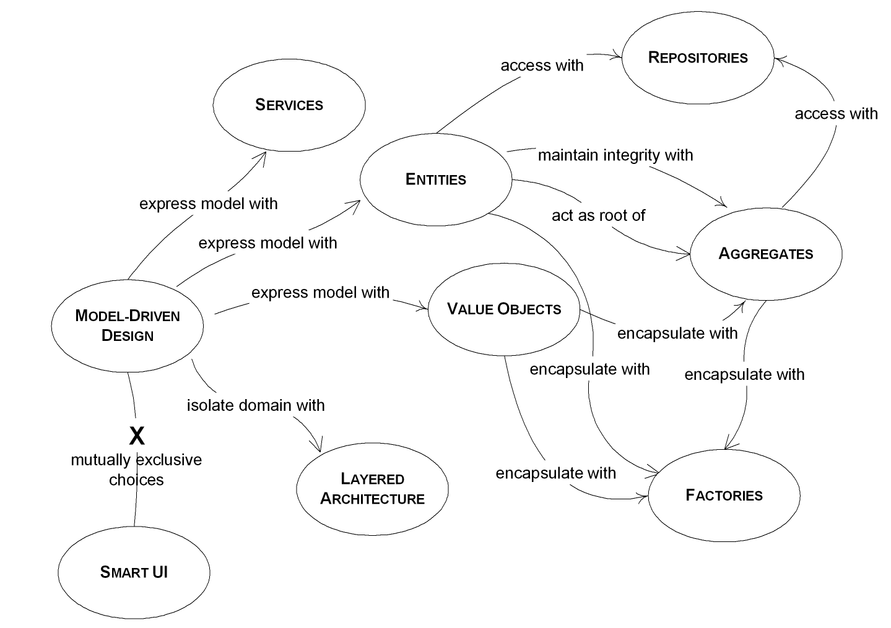

Architecture and principles
========================

.. contents::

Kasper defines the way the different architecture components must be written and interacts and provides abstract classes for them and some full implementations for infrastructure components.

Kasper defines five responsibility areas :

* The **COMMAND** area is responsible for :
    * defining and handling action commands
    * combining concepts and relations (DDD entities) together with business rules in order to model the business domain
    * generating domain events
    * persisting the entities
    * interact with business indexes for validation purposes

* The **QUERY** area is responsible for :
    * listening for domain events, denormalizing them to a dedicated storage or sending them to another subsystem (mail delivery for instance)
    * defining and handling data queries
    * indexing events into dedicated storage backends

* The **NEUTRAL** area provides some platform services to the two other layers, such as security mechanisms (Authentication/Identifcation) and ACLs (Authorizations)

* The **PRODUCT**, or platform client :
    * responsible to send commands to the platform, mainly asynchronously, and to manage user flow and interactions (task oriented)
    * responsible for sending data requests to the platform

* The **EVENT BUS** is responsible for dealing for the event communication, persistence and storage

The implementation of the event platform is not fully part of the Kasper framework, which only manages with APPLICATION and DOMAIN events.

Using Kasper you'll first need to understand some major facts :

1. Your model is split into two parts :
    * the **write model** (command), enclosing the main part of your business model
      (validation, business relations, services, events, inter-domain communications)
    * the **read model** (query), enclosing data transfer logic and indexation policies
2. The write model (command) is known to have **ACID** transactional properties (http://en.wikipedia.org/wiki/ACID)
3. The read model try to prepare the data to be read with a minimum of computations and is known to be **BASE** (Basically Available, Soft state, Eventual consistency : http://en.wikipedia.org/wiki/Eventual_consistency)
4. The entity store, the business indexes and query indexes are logical components, nothing is said by Kasper about their real implementation, in the worst case
   these three stores can be implemented by the same backend with the same data, but you'll loose a major part of the CQRS pattern.. In the best case these three
   components are implemented by different data stores, or at least with different data.
5. Query indexes are generally multiples, each index owned by a specific domain. In a idealistic way each query have it's own index. If for infrastructure constraints
   you have to share indexes between several domains, this index have to be owned by one domain and used by others under schema policy responsibility of the first one.
6. Even if the code of the commands and queries could be shared within one folder hierarchy, always consider command and query areas as separate applications communicating
   through events, imagine that the command area and query area are implemented by different companies for instance.
7. The interface of a domain is the specification of the **commands, queries and eventsi (C/Q/E)**. The internal model of a domain will never be shared between different domains.
8. Separation of concerns between command and query areas could eventually be broken by the infrastructure layer (even if deprecated), but never by the code itself.
9. Commands, queries, events and even the model must be developed with the product in mind, at each step, choose carefully the names of your software components with
   this idea always in mind, maintain the coherency between the code and the specification, they are different implementations of the same thing, expressed with
   an ubiquitous language shared between the product and technical teams (**Intention-revealing interfaces**).
10. Data persistence on COMMAND area is only required while we are not implementing our products on a Turing machine with infinite memory and storage. Think your model as a way to express
    the needs of your product first, then think your data persistence mechanisms at the end, when all other things has been done, it must be the last thing you want
    to think about.

..  _Recommended_modules_split:

Recommended modules split
-------------------------

A Kasper domain definition can be encapsulated in only one module, however Kasper framework encourage developers to split their domains in several modules, ensuring strict respect of the domain entities usage, anemic commands and events and atomic dependencies between domains.

The following diagram illustrates the five logical Kasper modules by domain with their dependency relations :

The domain exposition handlers are then clearly identified as being the 'commands', 'events' and 'query' modules :

An alternative, for those who dislike too many modules can be the following split :

BUT, you'll have to be perhaps a bit more strict on the usages of classes dependencies in order to not allow unwanted dependencies :

    * Event listeners should only know commands, it is allowed to make a dependency to domain if domain services are used directly, but be careful..
    * Command handlers should only know domain classes.. and commands
    * Commands, and events must not have any dependency to other domain classes
    * Commands must be known only by command handlers
    * DQOs and DTOs should only be used by query handlers
    * **NEVER, NEVER, NEVER, NEVER** allow usage of DOMAIN (COMMAND) module by QUERY module
    * **NEVER, NEVER, NEVER, NEVER** allow usage of QUERY module by DOMAIN module
    * **NEVER, NEVER, NEVER, NEVER** allow usage of QUERY or DOMAIN modules by the API module

..  _Principles_DDD:

Principles : Domain-Driven Design
-------------------------

Kasper domain modeling is heavily based on Domain-Driven Design paradigms.

.. topic:: Wikipedia - Domain-Driven design

    Domain-driven design (DDD) is an approach to develop software for complex needs by connecting the implementation to an evolving model. The premise of domain-driven design is the following:

    - Placing the project's primary focus on the core domain and domain logic.
    - Basing complex designs on a model of the domain.
    - Initiating a creative collaboration between technical and domain experts to iteratively refine a conceptual model that addresses particular domain problems.

    The term was coined by Eric Evans in his book of the same title.

    **Core definitions**

    **Domain**: A sphere of knowledge (ontology), influence, or activity. The subject area to which the user applies a program is the domain of the software.

    **Model**: A system of abstractions that describes selected aspects of a domain and can be used to solve problems related to that domain.

    **Ubiquitous Language**: A language structured around the domain model and used by all team members to connect all the activities of the team with the software.

    **Context**: The setting in which a word or statement appears that determines its meaning.

**DDD entities**

.. topic:: Wikipedia - DDD entity

    **Entity**: An object that is not defined by its attributes, but rather by a thread of continuity and its identity.

    *Example: Most airlines distinguish each seat uniquely on every flight. Each seat is an entity in this context. However, Southwest Airlines (or EasyJet/RyanAir for Europeans) does not distinguish between every seat; all seats are the same. In this context, a seat is actually a value object.*

In Domain-Driven Design an entity is a key element of the model (with value objects and services). It is an object enclosing data and
business methods which allows to mutate the entity or export its data in any pertinent form.

*ex: an Order, an OrderLine*

**DDD aggregates**

.. topic:: Wikipedia - DDD aggregate

    **Aggregate**: A collection of objects that are bound together by a root entity, otherwise known as an aggregate root. The aggregate root guarantees the consistency of changes being made within the aggregate by forbidding external objects from holding references to its members.
    *Example: When you drive a car, you do not have to worry about moving the wheels forward, making the engine combust with spark and fuel, etc.; you are simply driving the car. In this context, the car is an aggregate of several other objects and serves as the aggregate root to all of the other systems.*

.. topic:: Martin Fowler - DDD aggregate

    A DDD aggregate is a cluster of domain objects that can be treated as a single unit. An example may be an order and its line-items, these will be separate objects, but it's useful to treat the order (together with its line items) as a single aggregate.

    An aggregate will have one of its component objects be the aggregate root. Any references from outside the aggregate should only go to the aggregate root. The root can thus ensure the integrity of the aggregate as a whole.

    Aggregates are the basic element of transfer of data storage - you request to load or save whole aggregates. Transactions should not cross aggregate boundaries.

*ex: an Order, composed of several Order lines*

Instead of letting the domain user to create OrderLine instances independently and provides it to the Order objects, we will consider Order as the root of an aggregate.

This aggregate, managed by its root entity, will concentrate any operation that can be offered on its enclosing entities. Adding an OrderLine is then an internal behaviour of the aggregate, but this last
entity is not known as-is by the domain clients.

Adding an OrderLine is in fact the action to add a number of products to the Order for instance.

Instead of calling *order.add(new OrderLine(3, myproductId))* we'll just call *order.add(3, myproductId)*.

Because OrderLines has no reason to exists without the Order itself, because the root of the aggregate will ensure coherency within the whole aggregate. A general
amount counter can then be maintained directly in the aggregate for instance, which will be persisted as an atomic object in the datastore.
