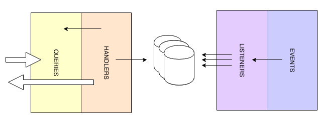

Defining the query side
========================

..  _Introduction_query_side:

Introduction
------------------------

The queries will only contain the methods for getting data. From an architectural point of view these would be all methods
that return DTOs that the clients consumes. The DTOs are usually projections of domain objects. But it's not the goal
to produce this pattern.

Using CQRS you can avoid these projections. Instead it is possible to introduce a new way of projecting DTOs. You can bypass
the domain model and get DTOs directly from the data storage using an handler as read layer. When an application is requesting
data, this could be done by a single call to the handler which returns a single DTO containing all the needed data.
This DTO will be represented by an implementation of `QueryResult` interface.

The query handler performs the following tasks:

* It receives the Query instance
* It validates that the Query is a valid Query
* It invokes the appropriate view to collect data.
* It returns the state at the request moment as result.

..  _Defining_a_query:

Defining a query
------------------------

A Kasper query is an immutable, anemic object used to request the platform for data, its class name ends with the suffix 'Query' (recommended).

A 'Query' must be a part of a domain API.

It is used by the client in order to send requests and by the query handler to understand the request and filter the indexed data.

A Kasper query has to implement the interface Query and can optionally defines some metadata using the `@XKasperQuery` annotation.

**usage**

.. code-block:: java
    :linenos:

    @XKasperQuery( description = "Get some things" )
    public class GetThingsQuery implements Query {

        public static final int DEFAULT_NUMBER_OF_THINGS = 10;

        private final int numberOfThings;

        public void GetThingsQuery() {
            this.numberOfThings = DEFAULT_NUMBER_OF_THINGS;
        }

        public void GetThingsQuery(final int numberOfThings) {
            this.numberOfThings = numberOfThings;
        }

        public int getNumberOfThings() {
            return this.numberOfThings;
        }

    }

Some sub interfaces are available in standard by Kasper framework :

* **com.viadeo.kasper.cqrs.query.OrderedQuery** : can be implemented when the response can be ordered.
* **com.viadeo.kasper.cqrs.query.PaginatedQuery** : can be implemented when the response can be paginated.

..  _Defining_a_query_result:

Defining a query result
----------------------------

A Kasper query result is an immutable, anemic object used by a query handler to send back data to the requesting client, it ends with the suffix ‘QueryResult‘ (recommended).

A 'QueryResult' must be a part of a domain API.

A Kasper query result has to implement the interface QueryResult and can optionally defines some metadata using the @XKasperQueryResult annotation.

**usage**

.. code-block:: java
    :linenos:

    @XKasperQueryResult( description = "A simple thing" )
    public class ThingsQueryResult implements QueryResult {
        private final String name;

        public ThingsQueryResult(final String nameOfThing) {
            this.name = nameOfThing;
        }

        public String getName() {
            return this.name;
        }
    }

Some sub classes are available in standard by Kasper framework :

* **com.viadeo.kasper.cqrs.query.PaginatedQueryResult** : can be implemented when the response is paginated.
* **com.viadeo.kasper.cqrs.query.EntityQueryResult**
* **com.viadeo.kasper.cqrs.query.CollectionQueryResult**
* **com.viadeo.kasper.cqrs.query.MapQueryResult**

..  _Defining_a_query_handler:

Defining a query handler
----------------------------

A Kasper query handler is I/O component using a **Query** as input and responsible to return a **QueryResult**.

**A Query service is part of the QUERY architectural area**.

It has to extend **QueryHandler<Query, QueryResult>** and specify its owning domain with the **@XKasperQueryHandler** annotation and ends with the '**QueryHandler**' suffix (recommended).

**usage**

.. code-block:: java
    :linenos:

    @XKasperQueryHandler( domain = ThingsDomain.class )
    public class GetThingsQueryHandler extends QueryHandler<GetThingsQuery, ThingsListQueryResult> {

        @Override
        public QueryResponse<ThingsListQueryResult> retrieve(final QueryMessage<GetThingsQuery> message) throws KasperQueryException {
            ...
        }

    }

You have to implement at least one of the **retrieve()** methods, the second one only take the query without the message :

**usage**

.. code-block:: java
    :linenos:

    @XKasperQueryHandler( domain = ThingsDomain.class )
    public class GetThingsQueryHandler extends QueryHandler<GetThingsQuery, ThingsListQueryResult> {

        @Override
        public QueryResponse<ThingsListQueryResult> retrieve(final GetThingsQuery query) throws KasperQueryException {
            ...
        }

    }

..  _Caching_query_response:

Caching query response
----------------------------

Kasper framework provides a way to cache query responses based on the submitted query, the cache is enabled per QueryHandler and is disabled by default.

It is based on **JSR 107 - JCache** for selecting a cache implementation. By default no cache implementation is provided by the framework
you can use any implementation of JCache (for example using ehcache-jcache).

To enable the cache for a query handler with default configuration, just put **@XKasperQueryCache** annotation:

.. code-block:: java
    :linenos:

    @XKasperQueryHandler( domain = AwesomeDomain.class, cache = @XKasperQueryCache )
    public class GetNiceDataQueryHandler extends QueryHandler<GetNiceDataQuery, NiceDataQueryResult> {
        ...
    }

The default behaviour will be to use the **QueryAttributesKeyGenerator** for computing the key of the query and use a ttl of one hour.

**QueryAttributesKeyGenerator** is using the hashcode of your query if no key is defined, otherwise it will combine the hashcode of the keys.

Use only someField and anotherField in the generated key and have a ttl of 1 minute:

.. code-block:: java

    @XKasperQueryCache(keys = {"someField", "anotherField"}, ttl=60)

You can also have custom KeyGenerators, to do so just implement **QueryCacheKeyGenerator** and enable it:

.. code-block:: java

    @XKasperQueryCache( keyGenerator = MyKeyGenerator.class )

..  _Using_query_filter:

Using query filter
----------------------------

Kasper framework provides a way to add an interceptor to a specific query.

To add interceptor for a query handler, just put **@XKasperQueryFilter** annotation:

.. code-block:: java
    :linenos:

    @XKasperQueryFilter(value = {InterceptorA.class})
    @XKasperQueryHandler( domain = AwesomeDomain.class, cache = @XKasperQueryCache )
    public class GetNiceDataQueryHandler extends QueryHandler<GetNiceDataQuery, NiceDataQueryResult> {
        ...
    }

see :doc:`../3_defining_a_platform/5_defining_an_interceptor`
