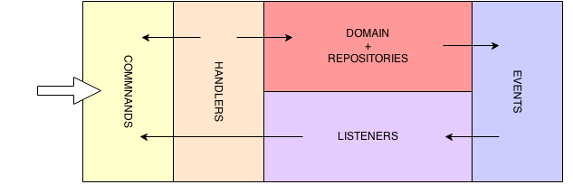
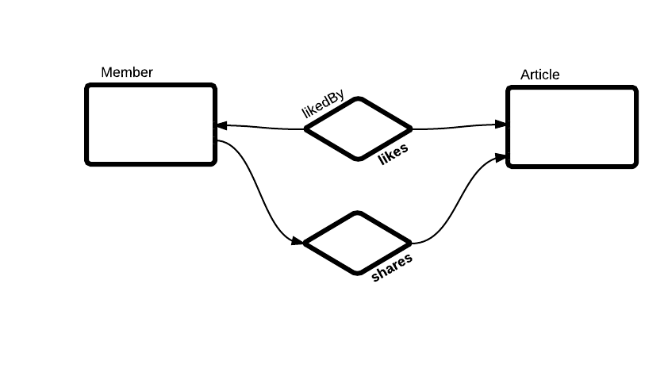

Defining the command side
========================

..  _Introduction_command_side:

Introduction
------------------------

The command side is focused on processing of commands, maintenance of model coherency and data persistence with ACID properties.

Commands are created by the client application and then sent to the domain layer. Commands are messages that instruct a
specific entity to perform a certain action. Commands are named like DoSomethingCommand (for example, ChangeMyNameCommand,
DeleteAnOrderCommand ...). They instruct the target entity to do something that might result in different outcomes or fail.
Commands are handled by command handlers.

All commands will be sent to the command bus which will delegate each command to the matching command handler. This demonstrates
that there is only one entry point into the domain. The responsibility of the command handlers is to execute the appropriate
domain behavior. Command handlers should have a connection to the repository to provide the ability to load the
needed aggregate (entity) on which behavior will be executed.

The command handler performs the following tasks:

* It receives the Command instance from the messaging infrastructure (Command Bus)
* It validates that the Command is a valid Command
* It locates the aggregate instance that is the target of the Command.
* It invokes the appropriate method on the aggregate instance passing in any parameter from the command.
* It persists the new state of the aggregate to storage (repository).

Using Kasper framework you'll have to define one and only one **command handler** per defined **command**.

..  _Domain_driven_design:

Domain-Driven Design
------------------------

DDD is an analysis and design approach that encourages you to use models and a ubiquitous language to bridge the gap between
the business and the development team by fostering a common understanding of the domain. Of necessity, the DDD approach
is oriented towards analyzing behavior rather than just data in the business domain, and this leads to a focus on modeling
and implementing behavior in the software. A natural way to implement the domain model in code is to use commands and events.

::

    "The model is a set of concepts built up in the heads of people on the project, with terms and relationships that
    reflect domain insight. These terms and interrelationships provide the semantics of a language that is tailored to
    the domain while being precise enough for technical development."

**—Eric Evans, "Domain-Driven Design: Tackling Complexity in the Heart of Software," p23.**

This list helps to capture the idea of a model, but is no substitute for reading the book to gain a deeper understanding
of the concept:

* Models should be bound to the implementation.
* You should cultivate a language based on the model.
* Models should be knowledge rich.
* You should brainstorm and experiment to develop the model.

In more DDD allows to divide large, complex systems into more manageable units known as bounded contexts. A bounded
context defines the context for a model:

::

    "Explicitly define the context within which a model applies. Explicitly set boundaries in terms of team organization,
    usage within specific parts of the application, and physical manifestations such as code bases and database schemas.
    Keep the model strictly consistent within these bounds, but don't be distracted or confused by issues outside."

**—Eric Evans, "Domain-Driven Design: Tackling Complexity in the Heart of Software," p335.**

The reasons for identifying context boundaries for your domain models are not necessarily the same reasons for choosing
the portions of the system that should use the CQRS pattern. In DDD, a bounded context defines the context for a model
and the scope of a ubiquitous language. You should implement the CQRS pattern to gain certain benefits for your application
such as scalability, simplicity, and maintainability. Because of these differences, it may make sense to think about
applying the CQRS pattern to business components rather than bounded contexts.

In summary, you should not apply the CQRS pattern to the top level of your system. You should clearly identify the different
portions of your system that you can design and implement largely independently of each other, and then only apply the CQRS
pattern to those portions where there are clear business benefits in doing so.

..  _Writing_aggregates:

Writing Aggregates
------------------------

Kasper aggregates must be written as event-sourced aggregates in order to ensure that every mutation will
generate an associated event :

* do not directly mutate the aggregate using a public method (even through constructor)
* use events and event handlers within the aggregate

.. code-block:: java
    :linenos:

    @XKasperConcept( domain = Members.class, label = "Member" )
    public class Member extends AbstractRootConcept {

        private String name;

        // -----

        public Member(final Context context, final String name) {
            apply(new MemberCreatedEvent(context, name));
        }

        @EventHandler
        protected void onCreated(final MemberCreatedEvent event) {
            this.name = event.getName();
        }

        // -----

        public void changeName(final Context, final String name) {
            if ( ! this.name.contentEquals(name)) {
                apply(new MemberNameChanged(context, name));
            }
        }

        @EventHandler
        public void onNameChanged(final MemberNameChanged event) {
            this.name = event.getName();
        }

    }

* apply() will immediately apply the event to the aggregate (eg. calling the declared event handlers within the aggregate)
* once applied the event will be generalized (recorded to the unit of work for further publication)

Entity-store repositories (which directly extends **Repository** instead of **EventSourcedRepository**) will need to
construct aggregates, they can have different strategies for that :

1. Generate event(s) from the entity store, build an empty aggregate and call their event handlers but the handlers have then
   to be public (**deprecated**)
2. Call a direct constructor of the aggregate which is reserved for this usage
3. Provide an internal static builder within the aggregate (**preferred way**)

In case you have to choose the second or third strategy, annotate your constructor with the **@XKasperEntityStoreCreator** marker.

..  _Modeling_a_concept:

Modeling a Concept
------------------------

A concept aggregate root is the base entity of a model. It is a persisted business entity as you can understand it in
many other object models.

*ex: a Car, a Member, a BlogPost, a Forum, a Job, ...*

As being the root of an aggregate, this kind of entity **can** hold references to component concepts and relations, but **must not
contain any direct reference to other aggregate roots without a intermediate relation entity**.

**An aggregate root in Kasper is not necessarily a composition of several entities**, it can just be a standalone object, persistable.

**usage**

.. code-block:: java
    :linenos:

    @XKasperConcept( domain = Vehicles.class, label = "A simple car" )
    public class Car extends Concept {

        private boolean started = true;

        // --

        public Car(final KasperId id) {
            apply(new ANewCarHasBeenCreatedEvent(id));
        }

        @EventHandler
        private void onCreated(final ANewCarHasBEenCreatedEvent event) {
            setId(event.getId());
        }

        // --

        public void startEngine() {
            apply(new EngineHasBeenStartedOnCarEvent());
        }

        @EventHandler
        private void onEngineStarted(final EngineHasBeenStartedOnCarEvent event) {
            if (this.started) {
                throw new CarIsAlwaysStarted();
            }
            this.started = true;
        }

        // --

        public void stopEngine() {
            apply(new EngineHasBeenStoppedOnCarEvent());
        }

        @EventHandler
        public void onEngineStopped(final EngineHasBeenStoppedOnCarEvent event) {
            if (!this.started) {
                throw new CarIsNotStarted();
            }
            this.started = false;
        }

    }

..  _Modeling_a_linked_concept:

Modeling a Linked Concept
------------------------

Never enclose a concept instance within another one :

.. code-block:: java
    :linenos:

    /* NEVER DO THIS */
    public class Member extends Concept {

        Member friendOf;

        ...

    }

Use instead a `LinkedConcept` which is a typed KasperId :

.. code-block:: java
    :linenos:

    /* NEVER DO THIS */
    public class Member extends Concept {

        LinkedConcept<Member> friendOf;

        ...

    }

This allows a better identification of links between concepts.

..  _Modeling_a_relation:

Modeling a Relation
------------------------

A relation aggregate root is used to connect two concept aggregate roots with some optional metadata.

This implies that the two connected concept aggregate roots **can exists within the system independently, without this relation**.

A relation is by default unidirectional, a concept root A is connected to a concept root B. Adding the annotation
**@XBidirectional** to a relation makes it understandable as a bidirectional relation.

Kasper encourage to use a specific class names nomenclature for relations :

**<SourceRootConceptName>_<RelationVerb>_<TargetRootConceptName>**

*ex of relation verbs: connectedTo, friendWith, likedBy/likes, shares/sharedBy*

**usage**

.. code-block:: java
    :linenos:

    @XBidirectional( verb = "likedBy" )
    @XKasperRelation( domain = MemberWall.class, verb = "likes", label = "A member liked an article" )
    public class Member_likes_Article extends Relation<Member, Article> {

        Member_likes_Article(final KasperId memberId, final KasperId articleId) {
            apply(new MemberLikedAnArticleEvent(memberId, articleId));
        }

        @EventHandler
        private void onCreated(final MemberLikedAnArticleEvent event) {
            setId(event.getMemberId(), event.getArticleId());
        }

    }

    @XKasperRelation( domain = MemberWall.class, label = "A member shares an article" )
    public class Member_shares_Article extends Relation<Member, Article> {

        Member_shares_Article(final KasperId memberId, final KasperId articleId) {
            apply(new MemberSharedAnArticle(memberId, articleId));
        }

        @EventHandler
        private void onCreated(final MemberSharedAnArticleEvent event {
            setId(event.getMemberId(), event.getArticleId());
        }

    }

TODO: add some stuff about verbs and ontologies, what will be took into account if empty, ...

..  _Modeling_a_value_object:

Modeling a Value object
------------------------

.. topic:: Wikipedia - DDD value object

    **Value Object**: An object that contains attributes but has no conceptual identity. They should be treated as immutable.

    *Example: When people exchange dollar bills, they generally do not distinguish between each unique bill; they only are concerned about the face value of the dollar bill. In this context, dollar bills are value objects. However, the Federal Reserve may be concerned about each unique bill; in this context each bill would be an entity.*

A value object is well.. just a value object..

But Kasper framework propose you two interfaces in order to better identify them and reinforce some good practices and
constraints.

**A value object is immutable.**

If you want to create a value object you can the interface **Value**.

The **Value** interface will force you to implement the **Serializable** interface and propose you to not miss the implementation
of the methods *toString()*, *hashCode()* and *equals()*.

**usage**

.. code-block:: java
    :linenos:

    public class WheelPosition implements Value {

        private static final enum AcceptedWheelPosition { FL, FR, BL, BR };

        private final AcceptedWheelPosition position;

        // -----

        private WheelPosition(final AcceptedWheelPosition position) {
            this.position = position;
        }

        // -----

        public static final frontLeft()  { return new WheelPosition(AcceptedWheelPosition.FL); }
        public static final frontRight() { return new WheelPosition(AcceptedWheelPosition.FR); }
        public static final backLeft()   { return new WheelPosition(AcceptedWheelPosition.BL); }
        public static final backRight()  { return new WheelPosition(AcceptedWheelPosition.BR); }

        // -----

        public boolean isFront() {
            return AcceptedWheelPosition.FL.equals(this.position)
                    || AcceptedWheelPosition.FR.equals(this.position);
        }

        public boolean isBack()  {
             return AcceptedWheelPosition.BL.equals(this.position)
                    || AcceptedWheelPosition.BR.equals(this.position);
        }

        public boolean isLeft()  {
             return AcceptedWheelPosition.FL.equals(this.position)
                    || AcceptedWheelPosition.BL.equals(this.position);
        }

        public boolean isRight() {
             return AcceptedWheelPosition.BR.equals(this.position)
                    || AcceptedWheelPosition.FR.equals(this.position);
        }

        // -----

        @Override
        public int hashCode() {
            return this.position.hashCode();
        }

        @Override
        public boolean equals(final Object other) {
            checkNotNull(other);
            if (this.getClass() != other.getClass()) {
                return false;
            }
            return this.position.equals((WheelPosition) other);
        }

        @Override
        public String toString() {
            return Objects.toStringHelper(this).addValue(this.position).toString();
        }

    }

Sometimes you just want to create a value object around one unique other type (primitive or not) and add management
methods to this enclosing value. Kasper framework propose you the **EnclosingValue** abstract class.

**usage**

.. code-block:: java
    :linenos:

    public class FirstName extends EnclosingValue<String> {

        public FirstName(final String firstName) {
            super(firstName);
        }

    }

..  _Defining_a_command:

Defining a command
------------------------

A command is an **immutable** anemic object (*DTO, Data Transfer Object*), implementing the interface **Command** whose class name ends by '*Command*'.

A command can optionally declares some metadata using the **@XKasperCommand** annotation.

**A Command is part of a domain API**.

The abstract class **CreateCommand** can be used to define an entity creation command, which contains an id to be used as
identifier for the entity to be created.

Two other abstract classes can be used for entity updates and deletion : **UpdateCommand** and **DeleteCommand**

**usage**

.. code-block:: java
    :linenos:

    @XKasperCommand( description = "An awesome command used to create a User" )
    public class CreateAUserCommand extends CreateCommand {

        private final String username;

        public CreateAUserCommand(final KasperID idToBeUsed, final String username) {
            super(idToBeUSed);

            this.username = checkNotNull(username);
        }

        public String getUsername() {
            return this.username;
        }

    }

..  _Defining_a_command_handler:

Defining a command handler
------------------------

A command handler is an object implementing **CommandHandler<Command>**, whose class name ends with '*CommandHandler*'.

It can also extend **BaseCommandHandler<Command>** which is the base implementation of an **CommandHandler**, or extend **AutowiredCommandHandler<Command>** which contains already the EventBus, the CommandGateway and the RepositoryManager.

A command handler **have to** declares its owning domain into the annotation **@XKasperCommandHandler**.

**A command handler is part of the COMMAND architectural area**.

The interface class **EntityCommandHandler<Command, Entity>**, implemented by abstracts classes **BaseEntityCommandHandler<Command, Entity>** and
**AutowiredEntityCommandHandler<Command, Entity>**, can be used to stick a command handler to a specific entity, it defines a method
*getRepository()* used to retrieve easily the repository corresponding to this entity. This interface class must generally be used when
defining a command mainly dedicated to create, modify and delete a domain entity.

**usage**

.. code-block:: java
    :linenos:

    @XKasperCommandHandler( domain = UserDomain.class, description = "Creates a user known to the application" )
    public class CreateAUserCommandHandler extends AutowiredEntityCommandHandler<User, CreateAUserCommand> {

        public CommandResponse handle(final CreateAUserCommand command) {
            final UserRepository repository = this.getRepository();

            final User user = new User(command.getIdToUse(), command.getUsername());
            repository.add(user);

            return CommandResponse.ok();
        }

    }

If you need to retrieve a different repository, use the method **getRepositoryOf** :

.. code-block:: java
    :linenos:

    @XKasperCommandHandler( domain = UserDomain.class, description = "Creates a user known to the application" )
    public class CreateAUserCommandHandler extends AutowiredEntityCommandHandler<User, CreateAUserCommand> {

        public Thing getThing() {
            Thing thing = null;

            final Optional<ThingRepository> thingRepositoryOpt = this.getRepositoryOf(Thing.class);
            if (thingRepositoryOpt.isPresent()) {
                thing = thingRepositoryOpt.get().load(...);
            }

            return thing;
        }

        public CommandResponse handle(final CreateAUserCommand command) {
            final UserRepository userRepository = this.getRepository();

            if (null != this.getThing()) {
                final User user = new User(command.getIdToUse(), command.getUsername());
                userRepository.add(user);
            } else {
                return CommandResponse.error(CoreErrorCode.INVALID_INPUT, "Thing was not found");
            }

            return CommandResponse.ok();
        }

    }

If you need to send non-domain events from the handler (available with **AutowiredCommandHandler** and **AutowiredEntityCommandHandler**), use **this.publish(event)**, do not try to inject the event bus
unless your event will not be sent during unit of work commit process.

..  _Defining_a_repository:

Defining a repository
------------------------

.. topic:: Wikipedia - DDD repository

    **Repository**: methods for retrieving domain objects should delegate to a specialized Repository object such that alternative storage implementations may be easily interchanged.

A DDD repository is used to manage with entities persistence, and as the only persistable entities in Kasper framework are the aggregate roots then Kasper repositories are
bound to a specific aggregate root.

In order to create a Kasper repository you have to extend **Repository<AggregateRoot>** annotating it with the
**@XKasperRepository** annotation.

**usage**

.. code-block:: java
    :linenos:

    @XKasperRepository( description = "Stores a Member into an SQL datastore" )
    public class MemberRepository extends Repository<Member> {

        private static final String REQ_SELECT = "SELECT name FROM Member WHERE id = %d and version = '%s'";
        private static final String REQ_INSERT = "INSERT INTO Member VALUES(%d, '%s', '%s')";
        private static final String REQ_DELETE = "DELETE FROM Member WHERE memberId = %d AND version = '%s'";

        @Override
        protected Optional<Member> doLoad(final KasperID memberId, final Long expectedVersion) {
            final response = sql.selectFirst(String.format(REQ_SELECT, memberId, expectedVersion));
            if (null != response) {
                return Optional.of(new Member(memberId,
                                              expectedVersion,
                                              response.get('name')));
            }
            return Optional.absent();
        }

        @Override
        protected void doSave(final Member member) {
            sql.exec(String.format(REQ_INSERT, member.getIdentifier(),
                                               member.getVersion(),
                                               member.getName()));
        }

        @Override
        protected void doDelete(final Member member) {
            sql.exec(String.format(REQ_DELETE, member.getIdentifier(), member.getVersion()));
        }

    }

You can also add new public methods to this repository in order to access to your business indexes (logically hosted in your COMMAND architectural area). These methods can later be accessed from command handlers using (ClientRepository).business()

Repositories are then accessed using the methods **load()**, **get()**, **has()** or **add()**, generally in command handlers only.

The **load()** method loads an entity from the repository and marks it so it will be automatically saved (doSave() will be called on your aggregate) on unit of work commit, while the **get()** method only load the aggregate without marking it to be automatically saved.

The **has()** method is not implemented by default, you'll have to override the **doHas()** method on your repository if you want this feature.

There is no **delete()** method on the repository. To delete an aggregate you have to create a specific method/handler on your loaded aggregate which calls the **markDeleted()** protected method internally. The aggregate is then marked as deleted, the **doDelete()** repository method will then be called once the unit of work is commited.
You are heavily encouraged to never delete data in your domains by just marking them as deleted. So in major cases doDelete() can just call doSave(), the loading of entities in Kasper repositories will take care of not loading deleted aggregates.

The doSave() method is use for entity creation AND update. If your backend needs to make the difference between
a creation or an update, you can :

- test **aggregate.getVersion()** for nullity in the **doSave()** method (newly created entities does not have a version)
- or implement the **doUpdate()** method, so entity creation will be automatically made calling **doSave()** and updates through **doUpdate()**

The **Repository** abstract class mut be considered as an **entity store** : the current state of entities is
stored, then events will be sent by the unit of work once entity is persisted. If you want to apply a real
event sourcing strategy, use instead the **EventSourcedRepository** supplying it an Axon **EventStore**.

