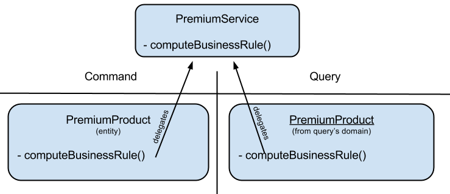

Defining a domain service
========================

.. topic:: Wikipedia - DDD service

    **Service**: When an operation does not conceptually belong to any object. Following the natural contours of the problem, you can implement these operations in services.

Kasper does not say nothing about domain services, but propose the **DomainService** marker interface in order to ease their global
identification. A domain service can be either a COMMAND area service or a QUERY area service.

You are encouraged to add the suffix **Service** to your class names.

**usage**

.. code-block:: java
    :linenos:

    public class PremiumService implements DomainService {

        public void businessRule(final int productId, final String toto) {
            ...
        }

    }

A service can be used to share a business logic between a query and a command inside a domain.

A good pattern is to enclose the service calls inside your business models on command an query sides, keeping a correct OOP approach
while centralizing business algorithms :

.. edit this drawing here: https://docs.google.com/a/viadeoteam.com/drawings/d/1-wHZytGl6HkbwoOrBUG0Sir_oK2TyJKpLRCp3CjFE-k/edit?usp=sharing

