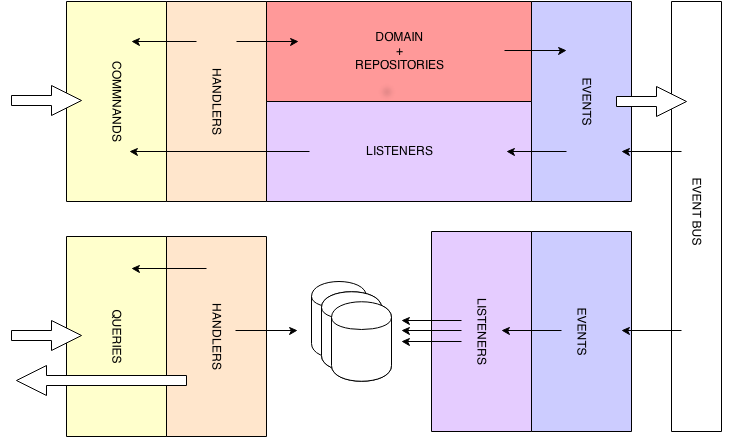

Defining a domain
========================

A domain is separated into several logical parts, dependencies are symbolized here as arrows :

So a domain :

* is split between the **COMMAND** and **QUERY** architectural areas
* offers an API composed of :
    * the **commands** it can handle
    * the **queries** it can result
    * the **query responses** it can send
    * the **events** it will emit
* cannot have access to any part of another domain other than its api components (C/Q/E)
* represent an atomic functional area, generally handled by only one close team

Contents

.. toctree::
    :maxdepth: 3

    1_implementing_a_domain
    2_defining_the_query_side
    3_defining_the_command_side
    4_defining_a_domain_service
    5_defining_an_event_system
    6_using_validation
    7_using_alias
