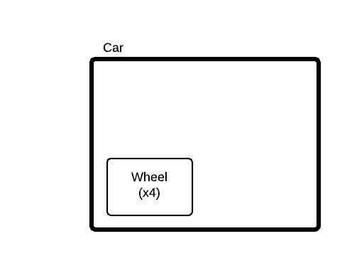
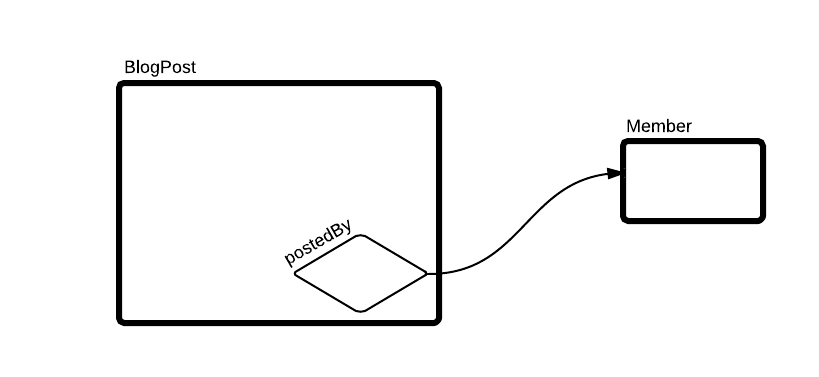
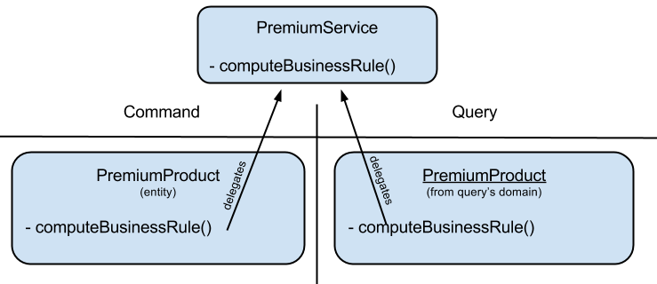

DDD: Domains modeling
=====================

Kasper domain modeling is heavily based on Domain-Driven Design paradigms.

.. topic:: Wikipedia - Domain-Driven design

    Domain-driven design (DDD) is an approach to develop software for complex needs by connecting the implementation to an evolving model. The premise of domain-driven design is the following:
    
    - Placing the project's primary focus on the core domain and domain logic.
    - Basing complex designs on a model of the domain.
    - Initiating a creative collaboration between technical and domain experts to iteratively refine a conceptual model that addresses particular domain problems.

    The term was coined by Eric Evans in his book of the same title.

    **Core definitions**

    **Domain**: A sphere of knowledge (ontology), influence, or activity. The subject area to which the user applies a program is the domain of the software.

    **Model**: A system of abstractions that describes selected aspects of a domain and can be used to solve problems related to that domain.

    **Ubiquitous Language**: A language structured around the domain model and used by all team members to connect all the activities of the team with the software.

    **Context**: The setting in which a word or statement appears that determines its meaning.

.. image:: ../img/ddd-diagram.png
    :scale: 45%
    :align: center

.. contents::

Entities
--------

.. topic:: Wikipedia - DDD entity

    **Entity**: An object that is not defined by its attributes, but rather by a thread of continuity and its identity.

    *Example: Most airlines distinguish each seat uniquely on every flight. Each seat is an entity in this context. However, Southwest Airlines (or EasyJet/RyanAir for Europeans) does not distinguish between every seat; all seats are the same. In this context, a seat is actually a value object.*

DDD entities
^^^^^^^^^^^^

In Domain-Driven Design an entity is a key element of the model (with value objects and services). It is an object enclosing data and
business methods which allows to mutate the entity or export its data in any pertinent form.

*ex: an Order, an OrderLine*

DDD aggregates
^^^^^^^^^^^^^^

.. topic:: Wikipedia - DDD aggregate

    **Aggregate**: A collection of objects that are bound together by a root entity, otherwise known as an aggregate root. The aggregate root guarantees the consistency of changes being made within the aggregate by forbidding external objects from holding references to its members.
    *Example: When you drive a car, you do not have to worry about moving the wheels forward, making the engine combust with spark and fuel, etc.; you are simply driving the car. In this context, the car is an aggregate of several other objects and serves as the aggregate root to all of the other systems.*

.. topic:: Martin Fowler - DDD aggregate

    A DDD aggregate is a cluster of domain objects that can be treated as a single unit. An example may be an order and its line-items, these will be separate objects, but it's useful to treat the order (together with its line items) as a single aggregate.

    An aggregate will have one of its component objects be the aggregate root. Any references from outside the aggregate should only go to the aggregate root. The root can thus ensure the integrity of the aggregate as a whole.

    Aggregates are the basic element of transfer of data storage - you request to load or save whole aggregates. Transactions should not cross aggregate boundaries.

*ex: an Order, composed of several Order lines*

Instead of letting the domain user to create OrderLine instances independently and provides it to the Order objects, we will consider Order as the root of an aggregate.

This aggregate, managed by its root entity, will concentrate any operation that can be offered on its enclosing entities. Adding an OrderLine is then an internal behaviour of the aggregate, but this last
entity is not known as-is by the domain clients.

Adding an OrderLine is in fact the action to add a number of products to the Order for instance.

Instead of calling *order.add(new OrderLine(3, myproductId))* we'll just call *order.add(3, myproductId)*.

Because OrderLines has no reason to exists without the Order itself, because the root of the aggregate will ensure coherency within the whole aggregate. A general
amount counter can then be maintained directly in the aggregate for instance, which will be persisted as an atomic object in the datastore.

Kasper E-R entities and aggregates
^^^^^^^^^^^^^^^^^^^^^^^^^^^^^^^^^^

Kasper re-inforce some of these aspects, it :

- generalize the **aggregate** as being **the only persistable entity** type (only aggregates can be persisted, no standalone entities)
- splits the entity component as besoin either a **Concept** or a **Relation**, defining an entity-relationship (E-R) model.

Kasper then provides four kind of entities :

+----------------------------------+---------------+-------------------+
|  Kasper entities interface name  |    **Root**   +   **Component**   |
+==================================+===============+===================+
|  **Concept**                     +  RootConcept  + ComponentConcept  |
+----------------------------------+---------------+-------------------+
|  **Relation**                    +  RootRelation + ComponentRelation +
+----------------------------------+---------------+-------------------+

A **Concept** is any entity which does not represent a relation between two other entities.

A **Relation** is an entity which links, with meaning, two other RootConcept entities.

A component entity is an entity which is part of an aggregate but do not represent its root entity, it's an **aggregate component**.

A Kasper entity is then :

- An aggregate **component** or an aggregate **root**
- A **Concept** or a **Relation** between concepts.

And implements one of the four interfaces **RootConcept**, **RootRelation**, **ComponentConcept** or **ComponentRelation**, declaring the owning domain
using the **@XKasperConcept** or **@XKasperRelation** annotations.

Four abstract classes are also provided, as a default implementation of some methods of these interfaces : **AbstractRootConcept**, **AbstractRootRelation**,
**AbstractComponentConcept** and **AbstractComponentRelation**.

Kasper proposes you two strategies for writing your aggregates :

.. toctree::
    :maxdepth: 2

    Aggregates

RootConcept
"""""""""""

A concept aggregate root is the base entity of a model. It is a persistable business entity as you can understand it in
many other object models.

*ex: a Car, a Member, a BlogPost, a Forum, a Job, ...*

As being the root of an aggregate, this kind of entity **can** hold references to component concepts and relations, but **must not
contain any direct reference to other aggregate roots without a intermediate relation entity**.

**An aggregate root in Kasper is not necessarily a composition of several entities**, it can just be a standalone object, persistable.

**usage**

.. code-block:: java
    :linenos:

    @XKasperConcept( domain = Vehicles.class, label = "A simple car" )
    public class Car extends AbstractRootConcept {

        private boolean started = true;

        public Car(final KasperId id) {
            setId(id);
        }

        public void startEngine() {
            if (this.started) {
                throw new CarIsAlwaysStarted();
            }
            this.started = true;
        }

        public void stopEngine() {
            if (!this.started) {
                throw new CarIsNotStarted();
            }
            this.started = false;
        }

    }

ComponentConcept
""""""""""""""""

A concept aggregate component is a part of an aggregate. This kind of entity will not be persisted alone.

*ex: a Car wheel*

The fact that a concept is an aggregate component or an aggregate root depends on your domain business. For instance
a car wheel will be an aggregate component for a car rental company, but will be an aggregate root for a spare part vendor..

**usage**

.. code-block:: java
    :linenos:

    public static enum WheelPosition { FRONT_LEFT, FRONT_RIGHT, BACK_LEFT, BACK_RIGHT }

    @XKasperConcept( domain = Vehicles.class, label = "A wheel, component of a car" )
    class Wheel extends AbstractComponentConcept {

        private WheelPosition position;
        private long totalDistance;

        Wheel(final WheelPosition position) {
            this.position = position;
            this.totalDistance = 0;
        }

        WheelPosition getPosition()
            { return this.position; }

        void goForward(final long distance)
            { this.totalDistance += distance; }

        void goBackward(final long distance)
            { this.totalDistance -= distance; }

    }

    @XKasperConcept( domain = Vehicles.class, label = "A car with 4 wheels" )
    public class Car extends AbstractRootConcept {

        private boolean started = true;
        private long totalDistance;
        private Set<Wheel> wheels;

        public Car(final KasperId id) {
            setId(id);
            this.totalDistance = 0;

            this.wheels = Sets.newHashSet();
            for (final WheelPosition position : WheelPosition.values()) {
                this.wheels.add(new Wheel(position));
            }
        }

        public void startEngine() {
            if (this.started) {
                throw new CarIsAlreadyStarted();
            }
            this.started = true;
        }

        public void stopEngine() {
            if (this.started) {
                throw new CarIsNotStarted();
            }
            this.started = false;
        }

        public goForward(final long distance) {
            assert(distance > 0);

            if (!this.started) {
                throw new CarIsNotStarted();
            }
            for (final Wheel wheel : this.wheels) {
                wheel.goForward(distance);
            }
        }

        public goBackward(final long distance) {
            assert(distance > 0);

            if (!this.started) {
                throw new CarIsNotStarted();
            }
            for (final Wheel wheel : this.wheels) {
                wheel.goBackward(distance);
            }
        }

    }

RootRelation
""""""""""""

A relation aggregate root is used to connect two concept aggregate roots with some optional metadata.

This implies that the two connected concept aggregate roots **can exists within the system independently, without this relation**.

A relation is by default unidirectional, a concept root A is connected to a concept root B. Adding the annotation
**@XBidirectional** to a relation makes it understandable as a bidirectional relation.

Kasper encourage to use a specific class names nomenclature for relations :

**<SourceRootConceptName>_<RelationVerb>_<TargetRootConceptName>**

*ex of relation verbs: connectedTo, friendWith, likedBy/likes, shares/sharedBy*

.. image:: ../img/ddd-kasper-root-relation.png
    :scale: 80%
    :align: center

**usage**

.. code-block:: java
    :linenos:

    @XBidirectional( verb = "likedBy" )
    @XKasperRelation( domain = MemberWall.class, verb = "likes", label = "A member liked an article" )
    public class Member_likes_Article extends AbstractRootRelation<Member, Article> {

        Member_likes_Article(final KasperId memberId, final KasperId articleId) {
            setId(memberId, articleId);
        }

    }

    @XKasperRelation( domain = MemberWall.class, label = "A member shares an article" )
    public class Member_shares_Article extends AbstractRootRelation<Member, Article> {

        Member_shares_Article(final KasperId memberId, final KasperId articleId) {
            setId(memberId, articleId);
        }

    }

TODO: add some stuff about verbs and ontologies, what will be took into account if empty, ...

ComponentRelation
"""""""""""""""""

A component relation is used within an aggregate in order to link this aggregate with another, external.

Used by one aggregate **A** when a link to another aggregate **B** it depends on cannot exists without him.

For instance a *BlogPost* is linked to a *Member* root concept.
The BlogPost cannot exists without the user who posted it, it has a deep link with it. The relation does not exists independently within the model.

The *BlogPost* root concept contains a unidirectional (default) component relation called *BlogPost_postedBy_Member* used to points out its creator.

**usage** (*warning: non event-sourced aggregate code*)

.. code-block:: java
    :linenos:

    @XKasperConcept( domain = Blogs.class, label = "A Member" )
    public class Member extends AbstractRootConcept {

        public Member(final KasperId id) {
            setId(id);
        }

    }

    @XKasperConcept( domain = Blogs.class, label = "A blog post, created by a member" )
    public class BlogPost extends AbstractRootConcept {

        private final String content;
        private final BlogPost_postedBy_Member memberRelation;

        public BlogPost(final KasperId id, final String message, final Member member) {
            setId(id);

            this.content = message;
            this.memberRelation = new BlogPost_postedBy_Member(getEntityId(), member.getEntityId());
        }

    }

    @XKasperRelation( domain = Blogs.class, label = "The relation between a blog post and its creator" )
    class BlogPost_postedBy_Member extends AbstractComponentRelation<BlogPost, Member> {

        BlogPost_postedBy_Member(final KasperId blogPostId, final KasperId memberId) {
            setId(blogPostId, memberId);
        }

    }

Entities composition rules
^^^^^^^^^^^^^^^^^^^^^^^^^^

Basically concepts can contain other component concepts and relations, relations can contain component concepts.

Another way to say the same thing is to state that a component concept can be contained in any other entity, a component
relation can only be contained in concept entities while aggregate roots can never be used as component entities (sic !).

+------------------------------+--------------+---------------+-------------------+--------------------+
| Can hold direct reference to | root concept | root relation | component concept | component relation |
+==============================+==============+===============+===================+====================+
|     root concept             |              |               |                   |                    |
+------------------------------+--------------+---------------+-------------------+--------------------+
|     root relation            |              |               |                   |                    |
+------------------------------+--------------+---------------+-------------------+--------------------+
|     component concept        |      -       |       -       |         -         |          -         |
+------------------------------+--------------+---------------+-------------------+--------------------+
|     component relation       |      -       |               |         -         |                    |
+------------------------------+--------------+---------------+-------------------+--------------------+

Factories
---------

.. topic:: Wikipedia - DDD entities factory

    **Factory**: methods for creating domain objects should delegate to a specialized Factory object such that alternative implementations may be easily interchanged.

Kasper does not say anything about factories, unless it is domain components, located into your COMMAND modules.

You can create your factories as you want, but you are encouraged to implement the marker interface **EntityFactory<Entity>**
in order to mark and better identify all of your factories, this interface encourage the use of the **Builder pattern**.

You are encouraged to add the suffix **Factory** to your class names.

**usage**

.. code-block:: java
    :linenos:

    public class MemberFactory implements EntityFactory<Member> {

        private final MemberEntity entityFromLegacy;
        private final KasperId id;

        private int age = 0;

        public MemberFactory(final MemberEntity entityFromLegacy, final KasperId id) {
            this.entityFromLegacy = checkNotNull(entityFromLegacy);
            this.id = checkNotNull(id);
        }

        public void age(final int age) {
            this.age = age;
        }

        @Override
        public Member build(final Context context) {
            final Mamber ret = new Member(this.id, this.entityFromLegacy.getName());
            if (0 != this.age) {
                ret.setAge(this.age);
            }
            return ret;
        }

    }

Repositories
------------

.. topic:: Wikipedia - DDD repository

    **Repository**: methods for retrieving domain objects should delegate to a specialized Repository object such that alternative storage implementations may be easily interchanged.

A DDD repository is used to manage with entities persistence, and as the only persistable entities in Kasper framework are the aggregate roots then Kasper repositories are
bound to a specific aggregate root.

In order to create a Kasper repository you have to extend **Repository<AggregateRoot>** annotating it with the
**@XKasperRepository** annotation.

**usage**

.. code-block:: java
    :linenos:

    @XKasperRepository( description = "Stores a Member into an SQL datastore" )
    public class MemberRepository extends Repository<Member> {

        private static final String REQ_SELECT = "SELECT name FROM Member WHERE id = %d and version = '%s'";
        private static final String REQ_INSERT = "INSERT INTO Member VALUES(%d, '%s', '%s')";
        private static final String REQ_DELETE = "DELETE FROM Member WHERE memberId = %d AND version = '%s'";

        @Override
        protected abstract Optional<Member> doLoad(final KasperID memberId, final Long expectedVersion) {
            final response = sql.selectFirst(String.format(REQ_SELECT, memberId, expectedVersion));
            if (null != response) {
                return Optional.of(new Member(memberId,
                                              expectedVersion,
                                              response.get('name')));
            }
            return Optional.absent();
        }

        @Override
        protected abstract void doSave(final Member member) {
            sql.exec(String.format(REQ_INSERT, member.getIdentifier(),
                                               member.getVersion(),
                                               member.getName()));
        }

        @Override
        protected abstract void doDelete(final Member member) {
            sql.exec(String.format(REQ_DELETE, member.getIdentifier(), member.getVersion()));
        }

    }

You can also add new public methods to this repository in order to access to your business indexes (logically hosted in your
COMMAND architectural area).

Repositories are then accessed using the methods load() or add(), generally in command handlers only.

If you want to delete an aggregate, use the markDeleted() method in your aggregates, this last will then be deleted at the end of the unit of work.

Value objects
-------------

.. topic:: Wikipedia - DDD value object

    **Value Object**: An object that contains attributes but has no conceptual identity. They should be treated as immutable.

    *Example: When people exchange dollar bills, they generally do not distinguish between each unique bill; they only are concerned about the face value of the dollar bill. In this context, dollar bills are value objects. However, the Federal Reserve may be concerned about each unique bill; in this context each bill would be an entity.*

A value object is well.. just a value object..

But Kasper framework propose you two interfaces in order to better identify them and reinforce some good practices and
constraints.

**A value object is immutable.**

If you want to create a value object you can the interface **Value**.

The **Value** interface will force you to implement the **Serializable** interface and propose you to not miss the implementation
of the methods *toString()*, *hashCode()* and *equals()*.

**usage**

.. code-block:: java
    :linenos:

    public class WheelPosition implements Value {

        private static final enum AcceptedWheelPosition { FL, FR, BL, BR };

        private final AcceptedWheelPosition position;

        // -----

        private WheelPosition(final AcceptedWheelPosition position) {
            this.position = position;
        }

        // -----

        public static final frontLeft()  { return new WheelPosition(AcceptedWheelPosition.FL); }
        public static final frontRight() { return new WheelPosition(AcceptedWheelPosition.FR); }
        public static final backLeft()   { return new WheelPosition(AcceptedWheelPosition.BL); }
        public static final backRight()  { return new WheelPosition(AcceptedWheelPosition.BR); }

        // -----

        public boolean isFront() {
            return AcceptedWheelPosition.FL.equals(this.position)
                    || AcceptedWheelPosition.FR.equals(this.position);
        }

        public boolean isBack()  {
             return AcceptedWheelPosition.BL.equals(this.position)
                    || AcceptedWheelPosition.BR.equals(this.position);
        }

        public boolean isLeft()  {
             return AcceptedWheelPosition.FL.equals(this.position)
                    || AcceptedWheelPosition.BL.equals(this.position);
        }

        public boolean isRight() {
             return AcceptedWheelPosition.BR.equals(this.position)
                    || AcceptedWheelPosition.FR.equals(this.position);
        }

        // -----

        @Override
        public int hashCode() {
            return this.position.hashCode();
        }

        @Override
        public boolean equals(final Object other) {
            checkNotNull(other);
            if (this.getClass() != other.getClass()) {
                return false;
            }
            return this.position.equals((WheelPosition) other);
        }

        @Override
        public String toString() {
            return Objects.toStringHelper(this).addValue(this.position).toString();
        }

    }

Sometimes you just want to create a value object around one unique other type (primitive or not) and add management
methods to this enclosing value. Kasper framework propose you the **AbstractEnclosingValue** abstract class.

**usage**

.. code-block:: java
    :linenos:

    public class FirstName extends AbstractEnclosingValue<String> {

        public FirstName(final String firstName) {
            super(firstName);
        }

    }

Domain services
---------------

.. topic:: Wikipedia - DDD service

    **Service**: When an operation does not conceptually belong to any object. Following the natural contours of the problem, you can implement these operations in services.

Kasper does not say nothing about domain services, but propose the **DomainService** marker interface in order to ease their global
identification. A domain service can be either a COMMAND area service or a QUERY area service.

You are encouraged to add the suffix **Service** to your class names.

**usage**

.. code-block:: java
    :linenos:

    public class PremiumService implements DomainService {

        public void businessRule(final int productId, final String toto) {
            ...
        }

    }

A service can be used to share a business logic between a query and a command inside a domain.

A good pattern is to enclose the service calls inside your business models on command an query sides, keeping a correct OOP approach
while centralizing business algorithms :

.. edit this drawing here: https://docs.google.com/a/viadeoteam.com/drawings/d/1-wHZytGl6HkbwoOrBUG0Sir_oK2TyJKpLRCp3CjFE-k/edit?usp=sharing

