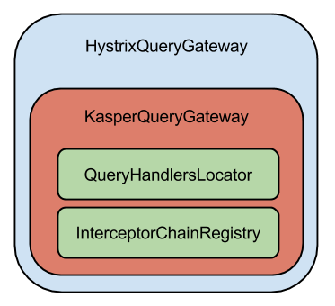

# Inside kasper framework

It's only available if a system property **"hystrixEnable"** is set to **"true"**.
Example:

    java -DhystrixEnable=true -jar my.jar 

## On command side

_KasperCommandGateway.java_ :

    final CommandGateway commandGateway = checkNotNull(commandGatewayFactoryBean.getObject()); // retrieve axon proxy
    
    // if hystrixEnable=true (system property)
    if (HystrixGateway.isActivated()) {
        this.commandGateway = new HystrixCommandGateway(commandGateway);
    } else {
        this.commandGateway = commandGateway;
    }

## On query side

_KasperPlatformConfiguration.java_: 

    // if hystrixEnable=true (system property)
    if (HystrixGateway.isActivated()) {
        this.queryGateway =  new HystrixQueryGateway(new KasperQueryGateway());
    } else {
        this.queryGateway = new KasperQueryGateway();
    }

## Class diagram

## Customization (Thread Pool, Circuirt breaker, ...)

See in the class com.viadeo.kasper.resilience.HystrixHelper:

     HystrixCommand.Setter
            // configure command group and command name
            .withGroupKey(HystrixCommandGroupKey.Factory.asKey(objGroupName))
            .andCommandKey(HystrixCommandKey.Factory.asKey(currentClass.getName()))
            // configure thread pool key
            .andThreadPoolKey(HystrixThreadPoolKey.Factory.asKey(currentClass.getPackage().getName()))
            // configure circuit breaker
                .andCommandPropertiesDefaults(
                    HystrixCommandProperties.Setter()
                        .withCircuitBreakerSleepWindowInMilliseconds(60000) // default to 500 ms
                        .withMetricsRollingStatisticalWindowInMilliseconds(60000) // default to 10000 ms
                        .withMetricsRollingStatisticalWindowBuckets(60) // default to 10
    );
 
# Metrics

Metrics are provided by registering a metric plublisher plugin.  
When we create a new HystrixCommand, Hystrix try to retrieve a metric publisher. 
The default implementation does nothing.    
To see your metrics, you will need an reporter for your metric registry. For an example, see GraphiteReporter.

We have 2 solutions to push and display metrics:

* use a custom publisher 

* use Hystrix EventStream + Hystrix Dashboard + (optionally Turbine if there are several app metrics to aggregate)  
  

## In our infrastructure
 
For simplicity, i choose the first solution to push metrics in Graphite.   
We use the plugin for codahale metrics. 
It only publishes the metrics to a metricRegistry.  
See **com.viadeo.kasper.resilience.HystrixGateway** for more details.

## Reference:

* [hystrix codahale metrics implementation](https://github.com/netflix/hystrix/tree/master/hystrix-contrib/hystrix-codahale-metrics-publisher)
* [codahale metrics](http://metrics.codahale.com/) 

# quick intro to hystrix
## processing logic

## how does the circuit breaker work ?

